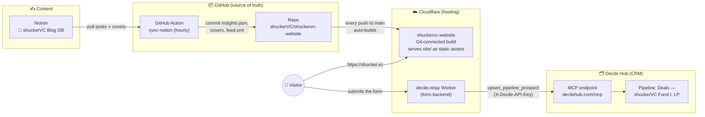
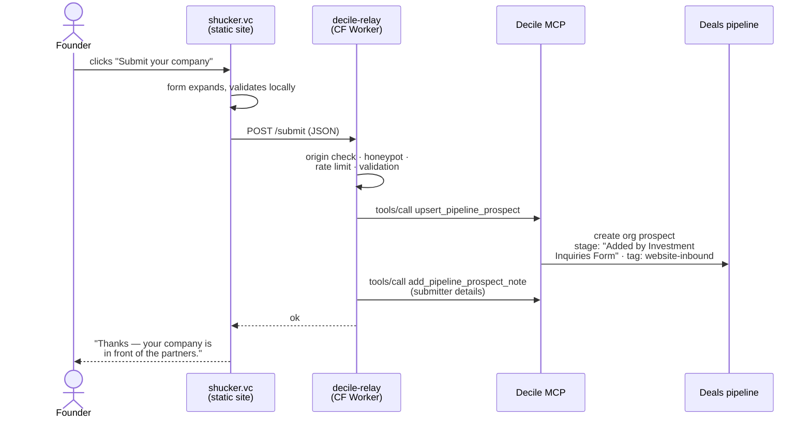
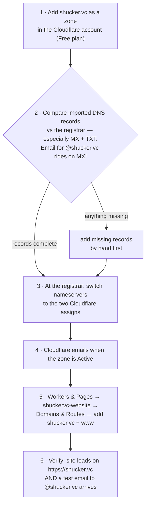

# shuckerVC Website — Architecture

One page for anyone touching the system (hi Graham 👋). Three diagrams: how the
site is built and served, how a founder's form submission reaches our deal
pipeline, and what the shucker.vc go-live changes.

---

## 1. The big picture

**Plain English:** the repo on GitHub is the single source of truth. Publishing
a blog post in Notion, or merging any code change, automatically redeploys the
site on Cloudflare within minutes — nobody deploys anything by hand. The only
separately-managed piece is the small form-relay Worker, which holds the Decile
API key as a secret.

*(GitHub Pages also still serves the old
`shuckervc.github.io/shuckervc-website` URL in parallel as stale-link
insurance. It updates from the same pushes and can be retired after go-live.)*

---

## 2. A founder submits their company

**Why MCP and not the REST API:** Decile's edge rejects write requests that
originate from Cloudflare Workers on their REST routes (verified extensively —
identical requests succeed from anywhere else). Their MCP endpoint accepts
Worker traffic, and it's their stated preference for programmatic integrations
anyway. Details in `workers/decile-relay/README.md`.

---

## 3. Go-live: what changes for shucker.vc (Graham's part)

The **only risky step is #2** — if the MX records don't survive the move,
email breaks. Everything else is reversible in minutes (switching nameservers
back undoes the whole thing). The old github.io URL keeps serving throughout,
so the website itself is never at risk.

---

## 4. Component inventory

| Component | Where | Auto-updates? | Owner |
|---|---|---|---|
| Website (static `site/`) | Cloudflare — Git-connected Workers build | ✅ on every push to `main` | eng |
| Blog content | Notion → hourly GitHub Action → commit | ✅ hourly (posts need Category + Published date) | JP / team |
| Form relay | Cloudflare Worker `shuckervc-decile-relay` | ✋ manual `wrangler deploy` (rarely changes) | eng |
| Deal intake | Decile pipeline "Deals - shuckerVC Fund I, LP" | ✅ receives form submissions live | JP |
| RSS feed | `site/feed.xml`, rebuilt by the sync | ✅ | — |
| Legacy URL | GitHub Pages (`shuckervc.github.io/…`) | ✅ same pushes | retire post-launch |
| DNS / domain | shucker.vc → Cloudflare zone (pending) | — | **Graham** |

## 5. Secrets (never in the repo)

| Secret | Lives in | Rotation |
|---|---|---|
| `NOTION_TOKEN` | GitHub Actions secrets | rotate in Notion → update repo secret; keep integration shared with the Blog DB |
| `DECILE_API_KEY` | Cloudflare Worker secret | regenerate in Decile Hub → `npx wrangler secret put DECILE_API_KEY` |
